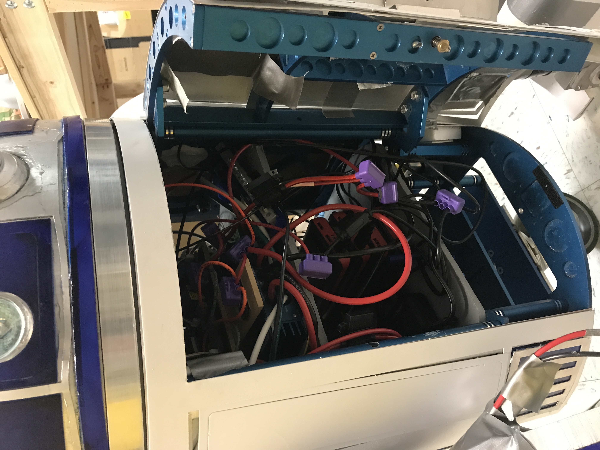
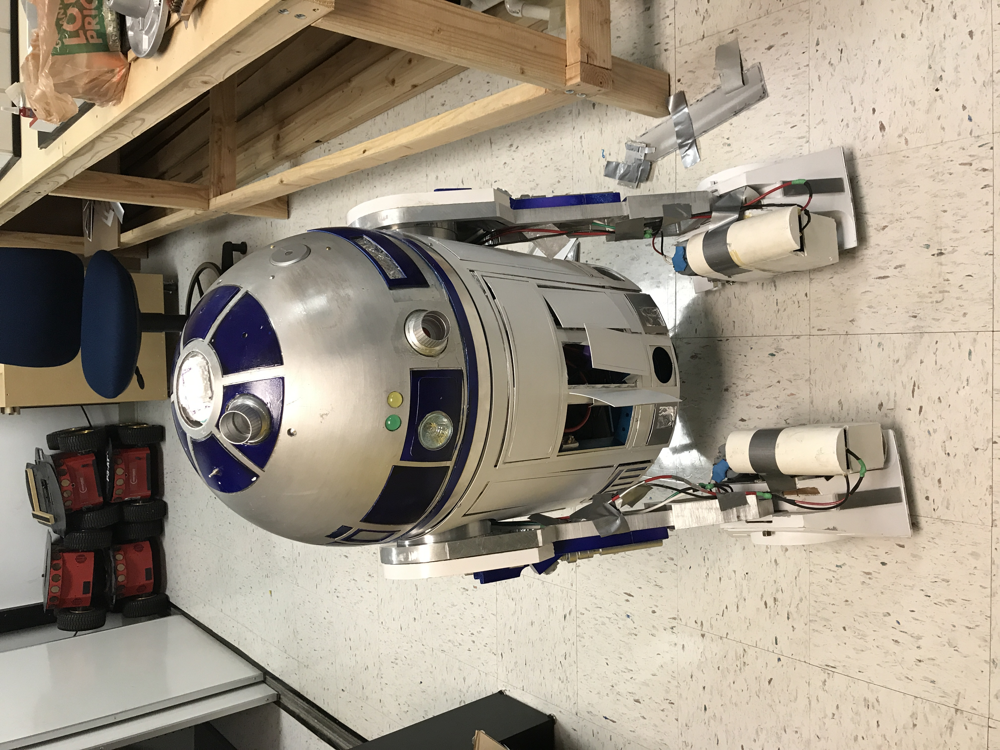
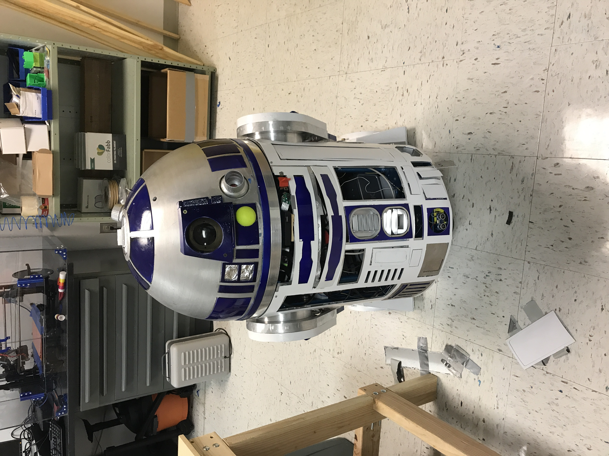
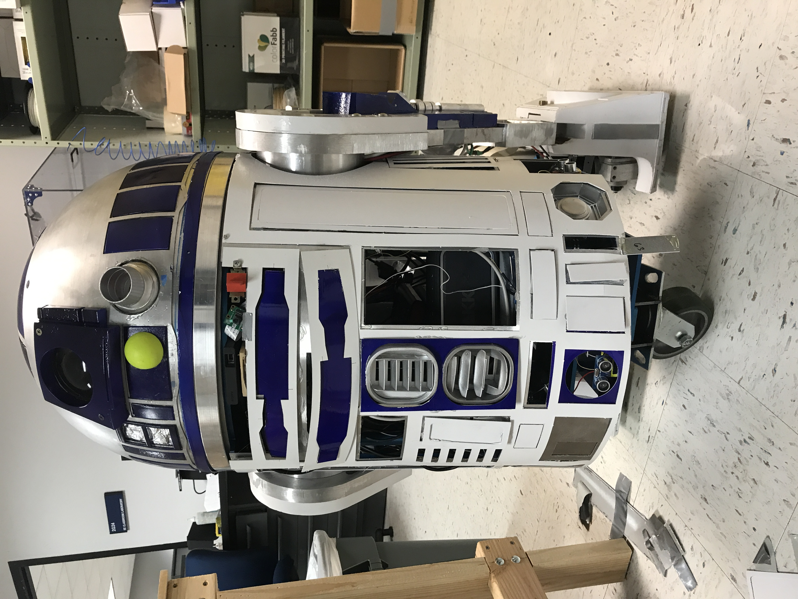
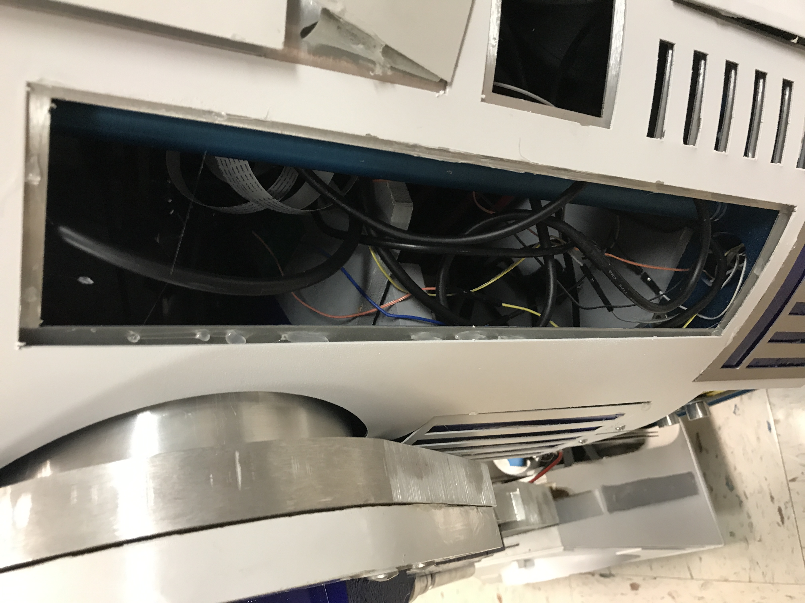
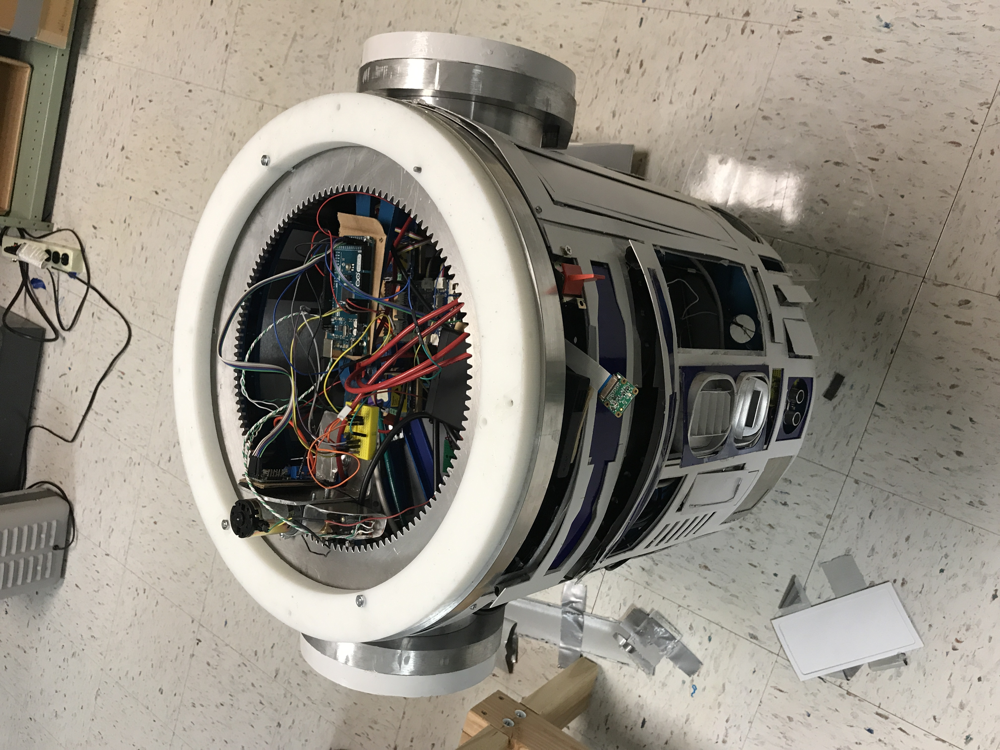
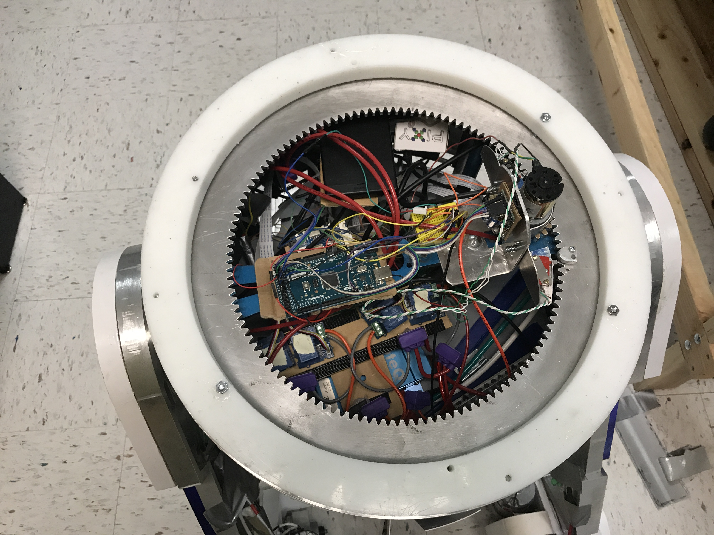

# 2017 R2D2 Capstone

"what a piece of junk" - Luke Skywalker upon seeing the *Falcon*

## Issues

- Impassable quagmire of wires/cables which led to things getting shorted out
- Tape and hot glue literally held the thing together, but the next day, things start to
fall off ... so much for duct tape being the greatest. Also, there is a huge mess of gorilla glue and epoxy everywhere making it look and feel (the whole thing is sticky) terrible
- Raspberry Pi camera is shorted out after being wedged (mounted) between some aluminum
- None of the LEDs are mounted, instead the holes are filled with tin foil (maybe it blocks the dark side's attempts at controlling R2?)
- Wood screws are used instead of bolts and they are falling out
- Breadboards, jumper wires and terrible soldering create a potential fire hazard
- Emergency kill switch is not correct and would not be effective in an emergency situation
- All of the motors are improperly mounted ... generally they are strapped on to the body instead of using the mounting holes built into them
- The battery boxes don't cover the leg motors
- The batteries are press fit into the battery boxes and cannot be removed
- The battery trade was done incorrectly and our batteries do not supply the correct current needed. Because the battery is stressed, it will have a much shorter life span than expected
- The motor driver is grossly oversized, bulky, and insanely expensive
- There is no plan for how to mount anything inside and nothing is modular
    - There are no connectors anywhere, everything is soldered together or multiple wire nuts were used to connect multiple lengths of short wires together into a larger wire
    - In order to remove the motor drive, the wires to it had to be cut ... however, a couple were just twisted together and wrapped in tap (no soldering)
- The software is written wrong (amateur at best) and incapable of being useful
- The front wheel was never mounted, instead, some silly wheel was on it. This made R2 lean forward and very susceptible to tipping over ... which happened
- No architectural diagrams or documentation on interfaces or software ... no clue what did what.
