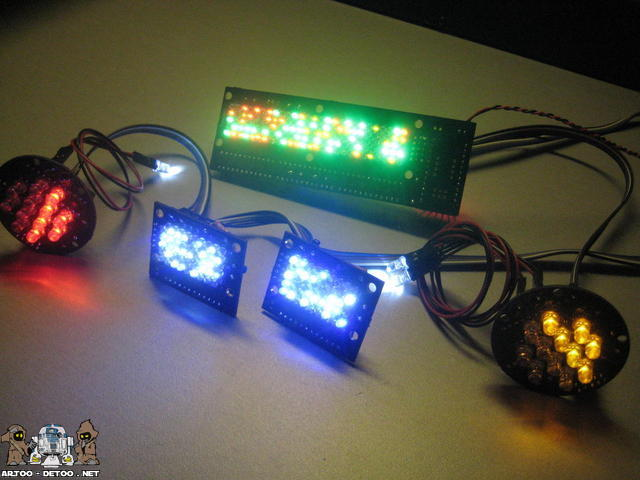

# Ideas - old

## Under the Dome

##### Yes, the Simpson's did it before Stephen King

### Doors

Shouldn't be too hard ... hinges, servos, etc.

### Lights

Would like to do the lights for R2. There are all kinds of kits or do-it-yourself. Leaning
towards simple LED matrices with I2C comm. Would be a great human-machine-interface
thing if you could make the lights mean something. Otherwise, random blinking is fine.

### Slip Ring

Previous design didn't use the dome for anything. Apparently doing what everyone else
does and put in a slip ring was beyond their capabilities. We are getting a 22mm 12 wire
(2A per wire) ring from [Adafruit](https://www.adafruit.com/product/1196) which should be
more than enough for power and data. The question will be reliability and construction
of said ring.

## Data

## Power

Use automotive relays to control power distribution. Basically hook them up
such that when 12V is attached for charging, they automatically disconnect the
batteries from the motors/robot and attach them to the charger.

Since all of the batteries are attached to the charging port, there is a charging
switch (manually operated) that a user must move to determine which battery will
be charged. This could be replaced with a circuit that measured the voltage of
each battery and determined which needed to be charged ... but let's start simple
first.

### Automotive Relay

The relays operate on 12V and can handle between 30A-40A depending on the type. They have 5 inputs:

- **Switch:** When 12V is applied across pins 85 and 86, a magnetic field is created and the relay switches from NC to NO path
- **Normally Closed (NC):** pins 30 and 87a are the default current path
- **Normally Open (NO):** pins 30 and 87 are the alternate current path

Some good references on relays:

- [How automotive relays work](https://www.youtube.com/watch?v=UAeKTlieYhw)
- [Explanation of different relay types](http://www.12voltplanet.co.uk/relay-guide.html)

### Batteries

The last version of R2 had multiple batteries, types, and voltages. This time
R2 will simplify to one type/voltage so we don't have to maintain different charger
and the added complexity that went along with that.

### Protection

Add a real emergency kill switch that cuts power to the motors. Prefer not to kill power to
the computer (typically not a good idea), plus, no one can get hurt by a raspberry pi.

The fuses are based on the last design. Not sure how much current is actually needed by the
leg motors nor what the continuous discharge rate of the selected batteries are.
All of the fuses will have to be properly sized.

### External Power

It is desired that R2 also serve as a static display. Being able to plug him into the
wall (automatically disable the leg motors so he can't move) and power the electronics
and maybe just the dome/periscope motors. In this configuration, the emergency safety
wouldn't work on the dome/periscope motors (remember the legs *are* disabled), but if
anything goes wrong, just pull the external power. Thinking a 12V 5A wall wart would work.

## Human Machine Interface

We could tie these to power up or reset the R2 electronics

## Motors

Re-selecting the Motor Controller, since it appears no engineering was done to select the
very expensive one we currently have.

Initial analysis is [here](motors.ipynb)

# How Ours Should Look

## Other Layouts

# Useful Links

- [www.artoo-detoo.net](http://www.artoo-detoo.net/tag/roboteq)
