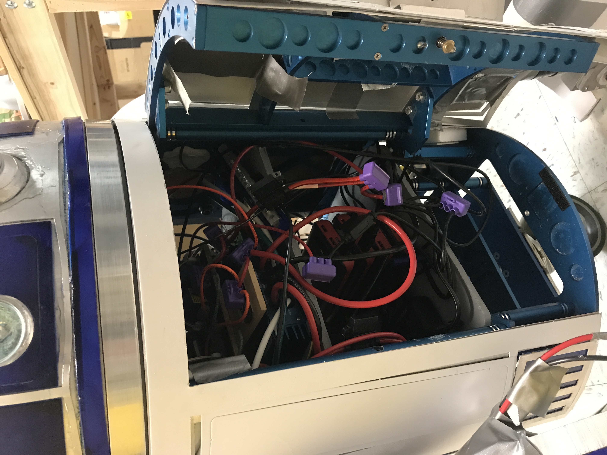
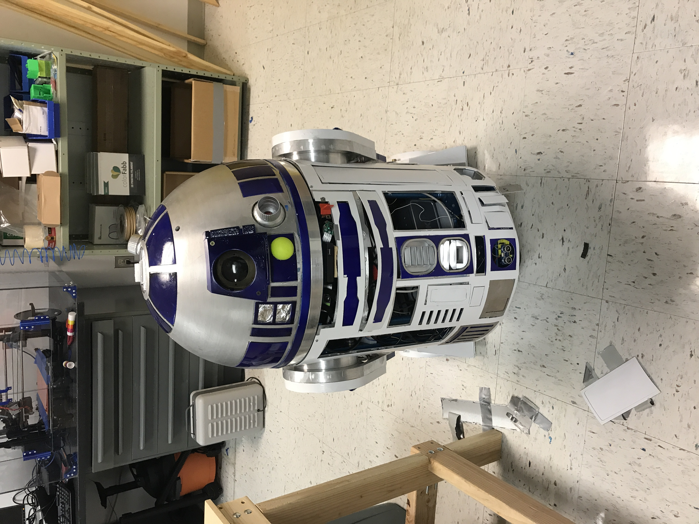
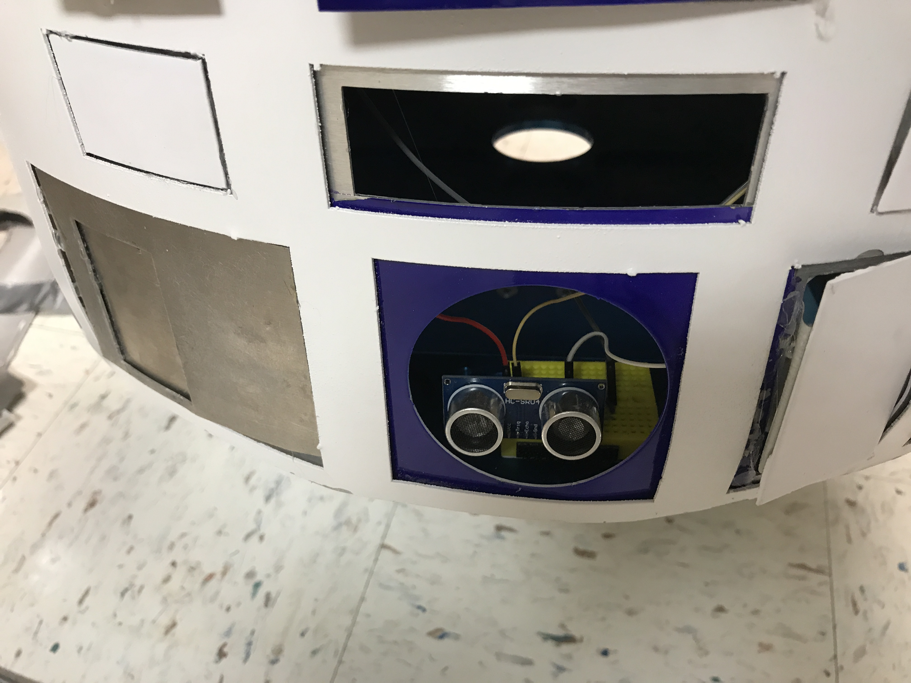
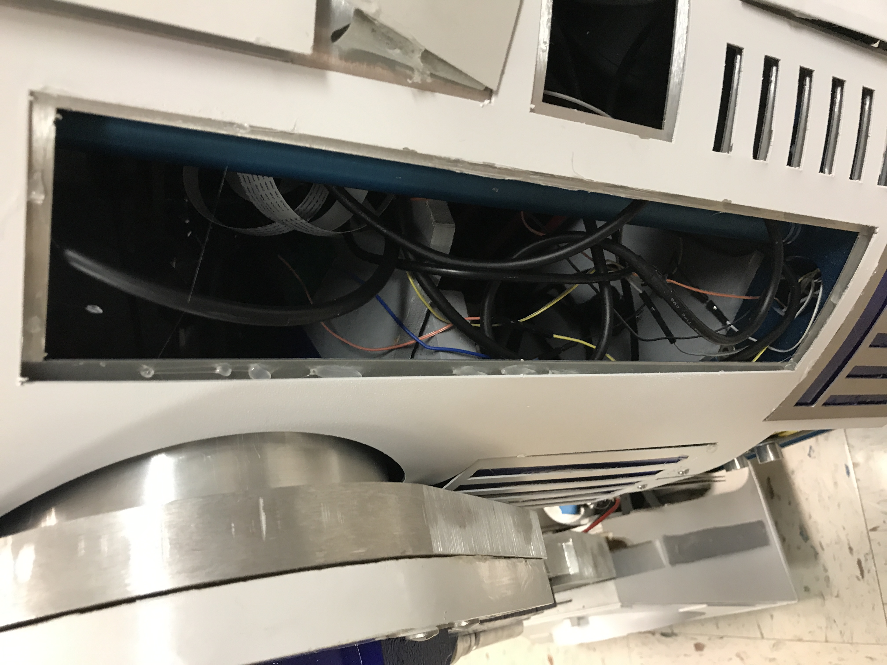
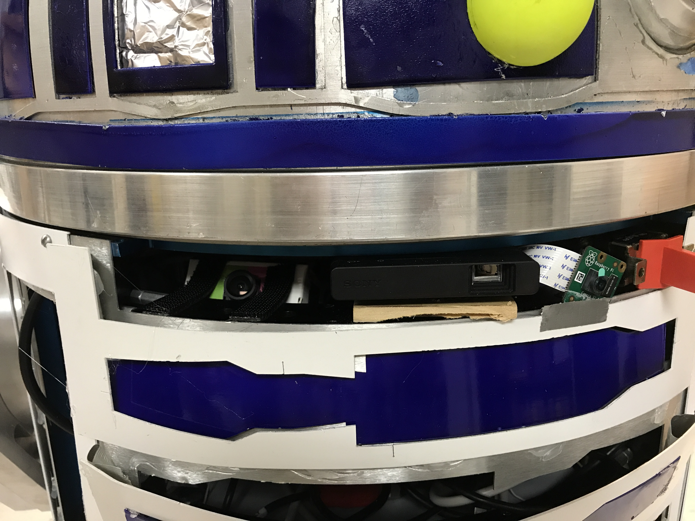
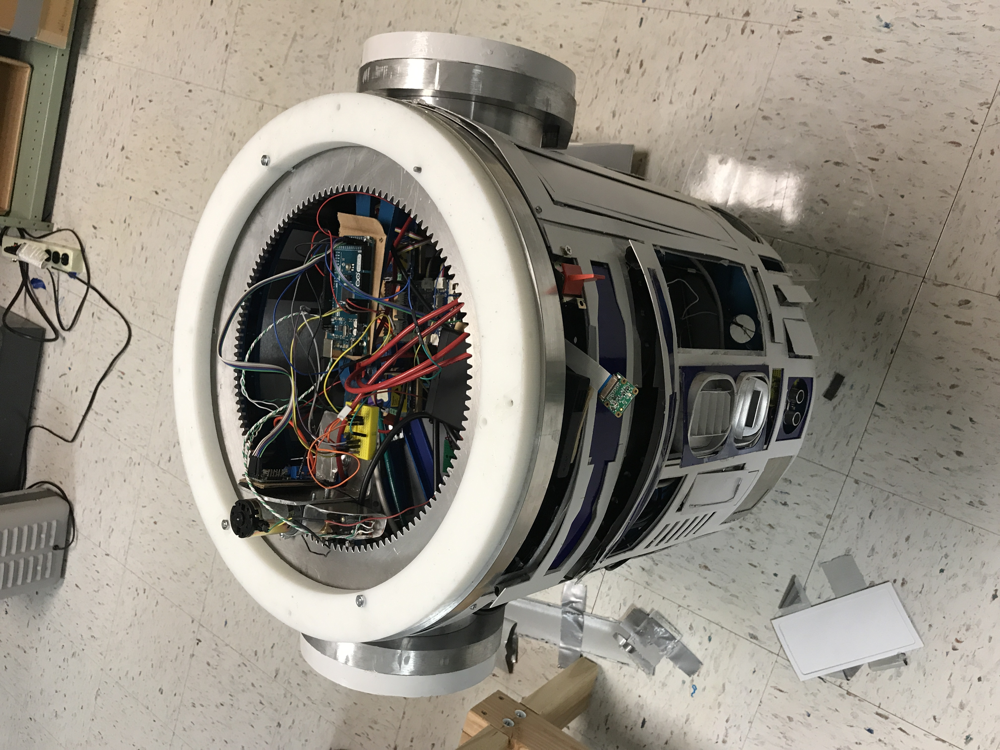
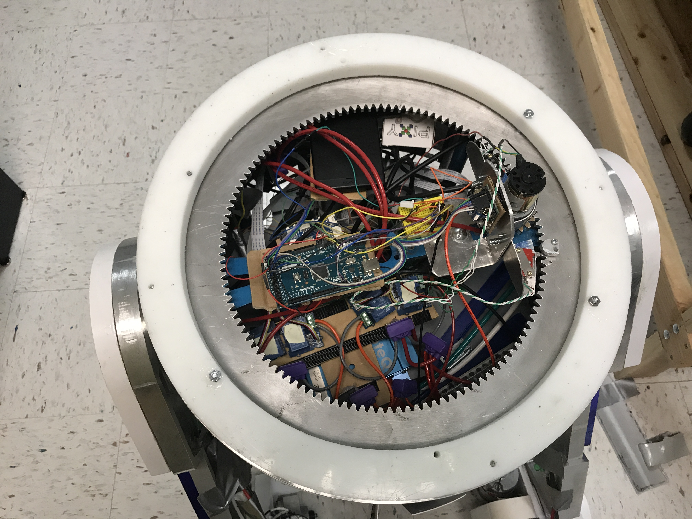

# 2017 R2D2 Capstone

"what a piece of junk" - Luke Skywalker upon seeing the *Falcon*

## Issues

- Impassable quagmire of wires/cables
- Tape and hot glue literally holds the thing together, but the next day, things start to 
fall off ... so much for duct tape being the greatest.
- Raspberry Pi camera is shorted out after being wedged (mounted) between some aluminum
- None of the LEDs are mounted, instead the holes are filled with tin foil
- Wood screws are used instead of bolts and they are falling out
- Breadboards, jumper wires and terrible soldering create a potential fire hazard
- Emergency kill switch is not correct
