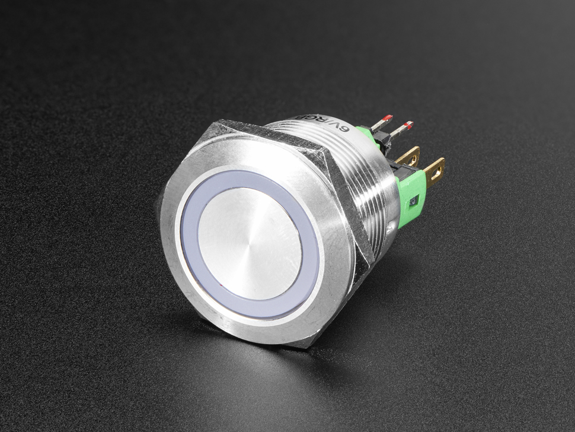

# LED Buttons

R2 uses both the on/off and momentary version. There are 2 sets of contact: NO and NC. There are also 4 pins: 5V, Red cathod, Green cathod, Blue cathod. If the cathod is HIGH, then the led is off. If the cathod is tied to ground, then the colored led turns on.

- [Datasheet](led_button.pdf)
- [Product link](https://www.adafruit.com/product/3423)
