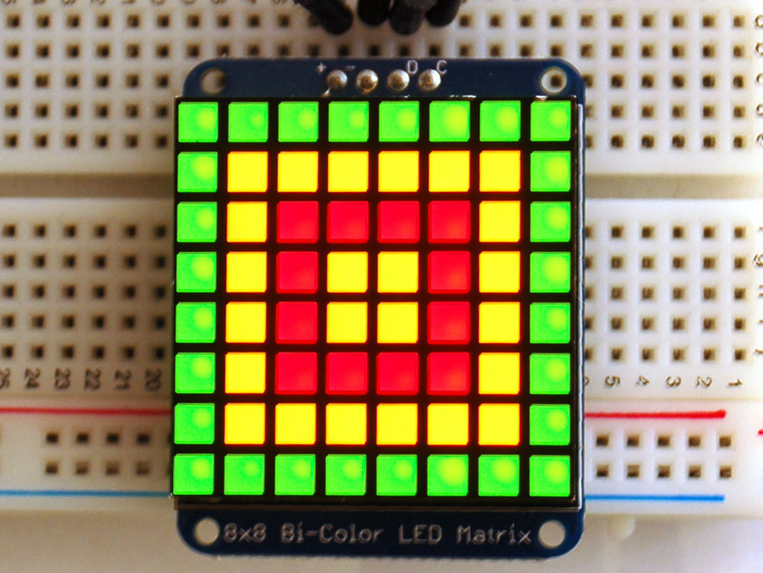

# I2C LED Bi-Color Matrix

This board/chip uses I2C 7-bit address between 0x70-0x77, selectable with jumpers.

33mm x 41mm x 4mm / 1.3" x 1.6" x 0.16"

- [Product link](https://www.adafruit.com/product/902)
- [matrix datasheet](led-matrix.pdf)
