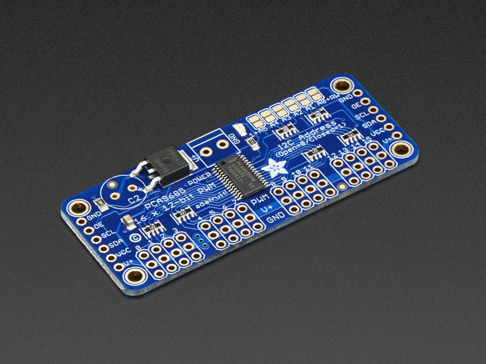

# I2C Servo Controller Board

You want to make a cool robot, maybe a hexapod walker, or maybe just a piece of art with a lot of moving parts. Or maybe you want to drive a lot of LEDs with precise PWM output. Then you realize that your microcontroller has a limited number of PWM outputs! What now? You could give up OR you could just get this handy PWM and Servo driver breakout.

When we saw this chip, we quickly realized what an excellent add-on this would be. Using only two pins, control 16 free-running PWM outputs! You can even chain up 62 breakouts to control up to 992 PWM outputs (which we would really like to see since it would be glorious)

- It's an i2c-controlled PWM driver with a built in clock. That means that, unlike the TLC5940 family, you do not need to continuously send it signal tying up your microcontroller, its completely free running!
- It is 5V compliant, which means you can control it from a 3.3V microcontroller and still safely drive up to 6V outputs (this is good for when you want to control white or blue LEDs with 3.4+ forward voltages)
- 6 address select pins so you can wire up to 62 of these on a single i2c bus, a total of 992 outputs - that's a lot of servos or LEDs
- Adjustable frequency PWM up to about 1.6 KHz
- 12-bit resolution for each output - for servos, that means about 4us resolution at 60Hz update rate
- Configurable push-pull or open-drain output
- Output enable pin to quickly disable all the outputs
- Terminal block for power input (or you can use the 0.1" breakouts on the side)
- Reverse polarity protection on the terminal block input. The terminal block included with your product may be blue or black.
- Green power-good LED
- 3 pin connectors in groups of 4 so you can plug in 16 servos at once (Servo plugs are slightly wider than 0.1" so you can only stack 4 next to each other on 0.1" header
- "Chain-able" design
- A spot to place a big capacitor on the V+ line (in case you need it)
- 220 ohm series resistors on all the output lines to protect them, and to make driving LEDs trivial
- Solder jumpers for the 6 address select pins

- [Product link](https://www.adafruit.com/product/815)
