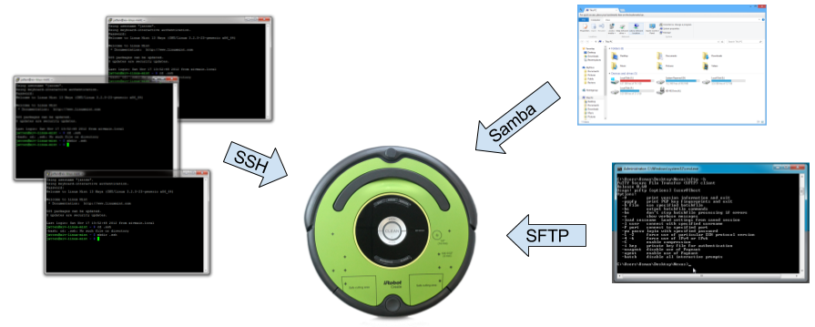
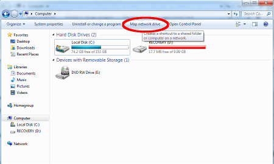
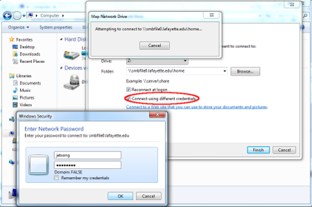
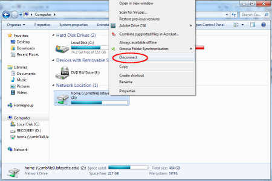
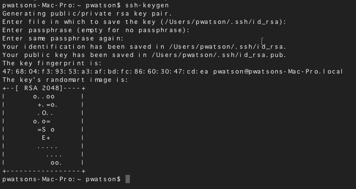

# Samba

{width=75%}

## Connect to Samba Share

Just like the network other drives, `K drive` for example, we can connect to
linux and bring up its hard drive. This will allow us to drag/drop code on
the linux system and edit it.

1. Click the **Start** button and select **Computer**
2. Click **Map a network drive** on the top toolbar

{width=50%}

3. Enter the share name: `\\10.10.10.1\t5`
    1. Remember to use the correct login name: `t5` or `t6`
    1. Make sure to check the box **Connect using different credentials**

{width=50%}

4. Click **Finish**
5. Input *username* and *password*

## Disconnect from Samba Share

{width=50%}

1. Click the **Start** button and select **Computer**
2. Right click on share
3. Select **Disconnect** from menu

# Secure Copy

Just in case you cannot connect up your laptop to linux using Samba, you can use
SCP to send/retrieve files between Windoze and Linux. The basic commands are:

    scp my_file.py <username>@<roomba_ip_address>:~     # from laptop to roomba
    scp <username>@<roomba_ip_address>:my_file.py .     # from roomba to your laptop's local directroy
    scp -r my_directory <username>@<roomba_ip_address>  # send an entire folder from laptop to roomba

Now when you are doing this, you might have to give a better location for the
file like:

    scp ~/ece387_work/test.py <username>@10.10.10.1:/home/<username>/my_stuff

Also, replace the *<roomba_ip_address>* with the correct IP address. For our class,
this *should always* be 10.10.10.1, but if working on a different linux computer, change accordingly.
This would transfer the file `test.py` located in your home directory on your
laptop and transfer it to the roomba. It would place it in the folder `my_stuff`
in users's home directory.

If you have setup your public/private key (as described below in the SSH section)
you will not have to input any passwords. Otherwise, you will be prompted for
pi's password, which is the default: `raspberry` (yes I know that is a bad thing).

# Secure Shell

To navigate linux, you need access to the command line. The only way to do that
is to use [secure shell](https://en.wikipedia.org/wiki/Secure_Shell) (ssh). This
process is going to allow you to login without
having to always supply a *username* and *password*. We will first create an
[RSA digital certificate](https://en.wikipedia.org/wiki/Public-key_cryptography)
(or pubic/private keys) and then install that cert on the robot.

The process will look similar to the screenshot below.

{width=50%}

1. Download and install [GitBash](https://git-scm.com/downloads) (this gives you everything you need)
2. Open a terminal window and navigate to your home directory, `cd ~`
3. Then generate an encrypted certificate with: `ssh-keygen.exe`. Just accept
   the default values and use an empty pass phrase (yes, not the most secure, but oh well ...)
4. Next we have to send that over to our linux system: `ssh-copy-id pi@robot_name.local`.
   Accept anything that pops up. You will need to put in the *username* and *password*
   to authenticate you can add this digital cert to the system.
5. Now test it out: `ssh <username>@<roomba_ip_address>`. It should log you directly into
   the robot, your authentication is handled via [Diffie–Hellman](https://en.wikipedia.org/wiki/Diffie%E2%80%93Hellman_key_exchange)
   protocol and the certificate we just created.
       1. If you are doing this on linux/unix, then you can use zeroconfig: `ssh t5@robot.local`.
       [Zeroconfig](https://en.wikipedia.org/wiki/Zero-configuration_networking),
       then does an multicast lookup and converts the computer name
       robot.local (or whatever the computer's name is) to an ip address.

# Accessing Windows from Linux

Sometimes you need to access a Windoze hard drive or another Linux system with a  
Samba share from a Linux system.

1. Edit `/etc/fstab` with the following line:
    ```bash
	//<server>/<share> <mountpoint> cifs username=pi,password=raspberry,defaults,users,auto 0 0
	```
    - *server*: server name like robot.local or an IP address like 10.10.10.2
    - *share*: folder to give access too, like `pi` (the default user's home folder)
    - *mountpoint*: where to mount the remote system to your local system.
    - Yes, I am using the default user and password ... change however you see fit.
1. Typically I put it in `/mnt`, so something like:
	```bash
	sudo mkdir /mnt/samba
	sudo chown pi:pi /mnt/samba      
	```
      1. Note in the `chown` command, the `pi:pi` should be changed to whatever username and
      group you want to change the folder `/mnt/samba` too
1. Now this should mount automatically after boot, but if not: `sudo mount -a`
