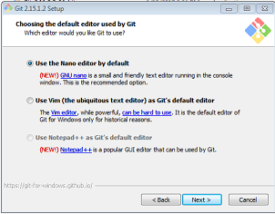
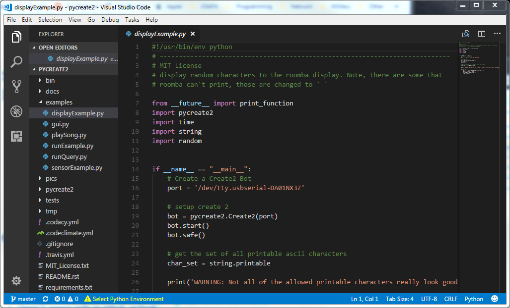

# Install

To get this to work, you need the following software installed on your laptop:

- `git-bash` to get use to the command line we will be using on our linux robots
- `python` which will be our primary programming language
- OpenCV 3.4.x for computer vision
- Jupyter notebooks, most of the class material is written in this and you will need it to turn some homeworks and labs

**WARNING:** 10CS loves to do a horrible job! Some people have issues with using the `pip` command
and get an error about SSL certificates. That is the EDU firewall screwing with us. Please just
go somewhere (like Arnold Hall which has open wifi or McDonalds) and run the command from there.

**WARNING:** Please follow the instructions to the letter and in order. They are correct! I 
have installed all of this software following these instructions on multiple computers.

## Git-Bash



1. Grab the git-bash package from [git-scm.com](https://git-scm.com/download/win)
    1. Take the default options, but there is a new one, see below:
    1. Something like the second window now asks if you want to install the nano text editor. I like
    nano, it is a very simple editor. Otherwise your default is vim, which is insanely complex
    and I personnally dislike.
1. Now to open a bash window, you can double click on the git-bash icon on your desktop or from the start menu: All Programs -> Git -> Git Bash

Also to make your life a little easier, use this `.bash_profile` (*note:* there
is a `.` on the front of the file name to indicate it is hidden). Just place this
in a simple text file and leave it in your home directory `C:/Users/<your name>`, my home folder, 
for example, is: `C:/Users/Kevin.Walchko`:

```bash
# start .bash_profile -------------------------
export PATH=/c/Python27:/c/Python27/Scripts:$PATH
alias python='winpty /c/Python27/python.exe'
alias pip='python -m pip'
alias ll='ls -lh'
alias ls='ls -Fh --color=auto --show-control-chars'

USR="\[\033[01;32m\]"
HOST="\[\033[01;35m\]"
DIR="\[\033[01;34m\]"
END="\[\033[0m\]"

export PS1="$USR\u@$HOST\h $DIR\W$END \$ "

# for some stupid reason, bash starts at root level
cd ~

# end .bash_profile ---------------------------
```

If there is already a `.bash_profile` there, then overwrite it with this one.

## Python

### Microsoft Compiler for Python 2.7

In order to build some of the python packages we need, you have to have a compiler
installed. For linux/unix, this isn't an issue. For Windoze, we need to get and
install one.

1. Download the [https://www.microsoft.com/en-us/download/details.aspx?id=44266](https://www.microsoft.com/en-us/download/details.aspx?id=44266)
1. Once you have it, double click and install it

### Install Python

**YOU MUST USE PYTHON 2.7**

1. Grab the python package from [https://www.python.org/downloads/windows/](https://www.python.org/downloads/windows/)
1. You should have something like `python-2.7.14.amd64.msi` which is the x86-64 MSI
installer, run that and install the software to your C: drive. Just take all of the default
options. You should end up with C:/Python27 on your hard drive. If not, you did something
wrong. Uninstall and try again.
1. Open a bash window
1. Update your software with: `pip install -U pip setuptools wheel`
1. Then install other python libraries: `pip install -U ar_markers future pysparklines pyserial the_collector numpy PyYAML nose simplejson fake-rpi build-utils`
1. Now do `pip list` and you should see each one of the above libraries installed.
Some of these will pull in other libraries too, so they maybe more than just the
above.

## OpenCV 3.4.0 (or newest)

1. Download OpenCV 3.4.x from [https://github.com/opencv/opencv/releases](https://github.com/opencv/opencv/releases). Look for a file name like `opencv-3.4.0-vc14_vc15.exe`. Obviously if the current version is `3.4.2`, the the filename will have that version number in it instead of `3.4.0` Your browser should put it in your `Downloads` folder. If it goes else where, then adjust the instructions below.
1. Go to the download location and double click on the `exe`, this will decompress it and create a `opencv` folder
1. Grab the opencv library (`cv2.pyd`) and put it into your python library
    1. from: `C:\Users\<your username>\Downloads\opencv\build\python\2.7\x64\cv2.pyd`
    1. to: `C:\Python27\Lib\site-packages`
1. Now test:
    1. open a bash window
    1. run: `python`
    1. type: `import cv2`
    1. if there are no errors ... you are good!
    1. type: `cv2.__version__` and the current version should come up ... something like 3.4.0 or whatever version you downloaded.
    1. If you have errors, you did something wrong! You have to put the library exactly where
    I told you and you have to have the python libraries (using `pip`) from the python install
    section installed. OpenCV depends on `numpy` and will crash if not installed.

If you ever need to update your system to a new version, like `3.4.4`, you can repeat this process. You *might* need to update the python library `numpy`, but that should be easily fixed with" `pip install -U numpy`. OpenCV and `numpy` are tighly coupled.

## Jupyter Notebooks

You have to have Python and GitBash installed already before you do this.

1. Open a bash window
1. Run: `pip install -U pip setuptools wheel`
1. Run: `pip install -U numpy jupyter opencvutils matplotlib jupyter_tools sympy`
1. Run `pip list` and you should see each one of these libraries installed. If not then
redo it.
1. Once that finishes installing, run: `jupyter notebook`
1. A webpage should open up. From there you can create or
   navigate to where your jupyter notebooks are stored and open them.

## [OPTIONAL] VS Studio



I am not a microsoft fan, but 10CS makes using my editor of choice [Atom](https://atom.io/) 
difficult to use here at USAFA. I have played around with Visual Studio Code which is **very**
similar to Atom, so I will suggest it if you need a decent python editor.

Download: https://code.visualstudio.com/?wt.mc_id=DX_841432

Just remember I haven't really done much with it yet.