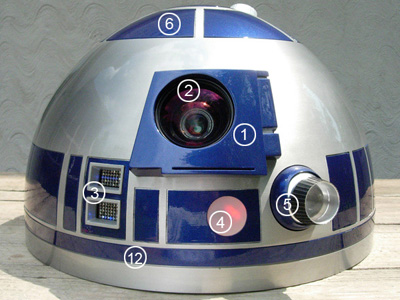
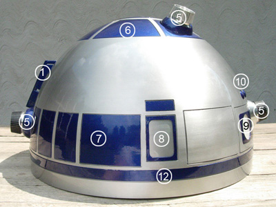
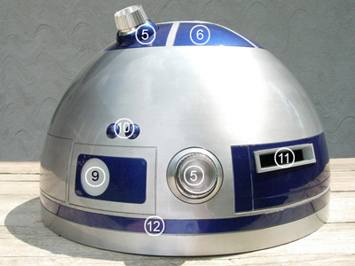
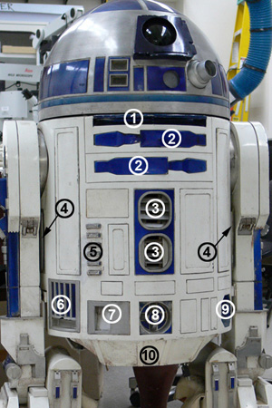
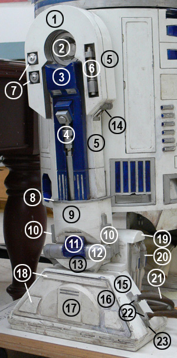

# R2-D2 Terminology and Parts

Here is an anatomy of an astromech, scrounged from the internet.

## Dome

1. Radar Eye
2. Radar Eye Lens
3. Front Logic Display
4. Front PSI (Process State Indicator)
5. Holoprojectors (HPs)
6. Pie Panels
7. Dome Panels
8. P5 Picture Panel
9. Rear PSI (Process State Indicator)
10. Dome Bumps
11. Rear Logic Display 
12. Dome Ring

## Body

1. Large Data Port (LDP)
2. Utility Arms
3. Front Vents
4. Side Vents
5. Coin Slots 
6. Pocket Vents
7. Coin Returns
8. Power Couplings
9. Octagonal Ports
10. Skirt

## Legs

1. Shoulder Horseshoes
2. Shoulder Hub
3. Booster Covers
4. Leg Struts
5. Main Leg
6. Shoulder Hydraulics
7. Shoulder Buttons
8. Ankle Bracelet
9. Outer Ankle Sides
10. Ankle Details
11. Ankle Cylinder Wedges
12. Ankle Cylinders
13. Ankle Cylinder Holders
14. Under Shoulder Details
15. Main Footshell
16. Foot Side Plate
17. Half Moon Details
18. Foot Details
19. Battery Boxes
20. Battery Box Harnesses
21. Foot Hoses
22. Knurled Fittings
23. Foot Strips

