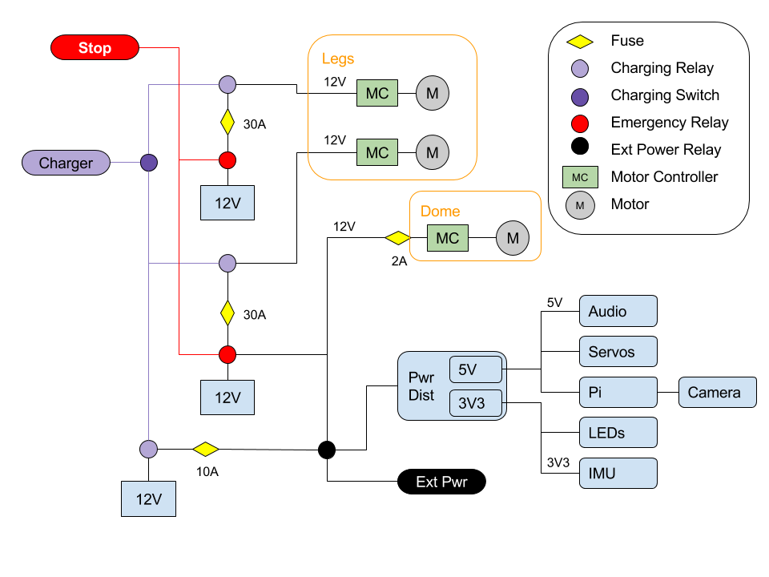
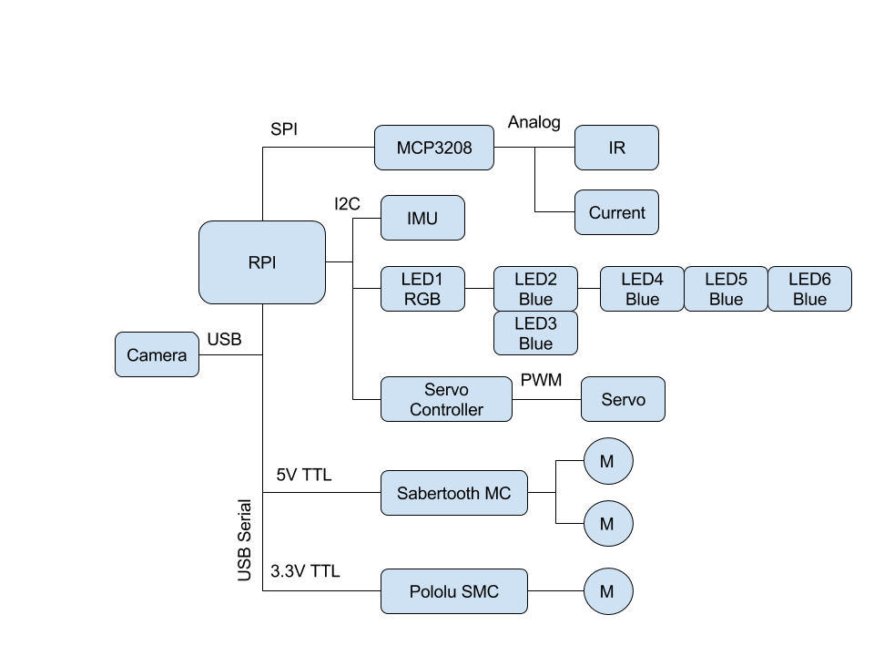
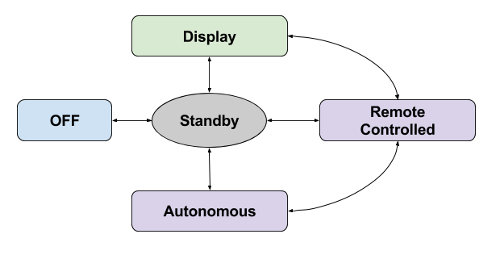

# R2-D2 Senior Design Project

This repo documents the progress of the R2-D2 design for the 2017-2018 class year. R2-D2's purpose, once
it is delivered, is to:

- Serve as an example of multi-diciplinary engineering
- Support internal events like: Major's Night, DF evnets, and DFEC events
- Support external events like: conventions, STEM outreach, and recruiting events.

# Architecture

## Power

The power system is modeled around a common 12V system. Relays are used to route power for emergency stop, charging, or other reasons.

Although there are mulitple batteries, they are all the same type of battery and therefore take the
same type of charging. The battery chemestry and capacity is TBD.

## Data

The system data shows the wiring between the pi and all of the sensors and effectors. Most of the communications operates at 3.3v, however, there is a USB serial that operates at 5v (5V TTL). The pi uses all of the buses available to it: I2C at 100 Hz, SPI, and USB. The PWM to drive the servos is off loaded to a hardware servo controller board. Similarly, the PWM which drives the motors is offloaded to 2 different motor controllers (Sabertooth and SMC).

## Software Operating Modes

The system shall follow the transition diagram shown above with the following definitions:

- **Off:** No R2D2 software is running and the Raspberry Pi (RPi) may or may not be powered on. This is
  not so much a designed software state so much as a reality of "off".
- **Standby:** When R2 software is started, it will enter this state and remain until commanded to exit. 
  No motor (servos, legs, or dome) are allowed to run. This state produces and is capable of recording
  telemetry. This state is the only state where charging will occur. When the power plug is connected,
  the robot will change from whatever state it is in to this one.
- **Remote Controlled:** When commanded into this state, the robot will except commands from the
  joystick. The commands will be followed except where sensor (TBD) detect hazards and prevent the
  operator from damaging the robot. In this state, all motors are enabled.
- **Display:** When commanded into this state, the robot acts like a robotic static display. The leg
  motors are not enabled, however the dome motor is able to move. This mode is entered either by
  a software command or external power supplied to the robot which will trigger relays and automatically
  cut power to the leg motors.
- **Autonomous [objective]:** When commanded into this mode, the robot will autonomous move and avoid obstacles
  using its onboard sensors (TBD). When any issue arrises (i.e., motor currents exceeded, loss of 
  sensors prohibiting safe opperation, TBD) the robot will immediately go to standby mode.

The system shall be designed to run the R2 software as a Debian service under `systemd`
once everything works. During development, this won't be implemented for safety reasons.

# Requirements

1. [KPP] R2 shall operate safely in one of the states described above. Any loss of command or fault will
   automatically transitition the robot into Standby mode.

1. [KPP] When the emergency stop (EMS) button is pressed, R2 shall remove power to all motors, but
    all electronics shall continue to operate producing telemetry and status info. 
     1. The EMS shall be mounted where R2's inhibitor switch is located in Episode IV.

1. R2's sensor suite shall allow:
    1. Measure voltage and current at the leg motor batteries and electronics battery. When batteries are low, notify user and when a prescribed depth of discharge is reached, switch operating mode to standby until batteries are charged.
    1. Sense orientation and switch to standby if R2 has fallen down (exceeds a pitch or roll in excess of a predefined value). R2 shall also emit warning sounds and flash displays periodically (time interval is TBD) to indicate its need for assistance.
    1. Sense Earth's magnetic field, process the information, and use for navigation as needed
    1. Sense angle of dome in order to point the dome in a defined direction
    1. Sense the environment infront of it visually and be capable of:
        1. detecting faces in imagery
        1. detecting scene change (i.e., someone entering a room)
        1. Recognize specified individuals (full list is TBD, but for ex: Darth Vader, Luke, Han) under ideal conditions
        1. streaming (mjpeg) to any standards compliant web browser
    1. Measure leg wheel rotations and process data to determine distance travelled (odometry)
    1. [objective] Record audio for speech-to-text processing
    1. [objective] R2 shall sense stairs and drop-offs (or absence of floor) 360 degrees around it along the floor plane
    1. [objective] R2 shall sense obstacles 360 degrees around it along the floor plane

1. [KPP] While in static display mode, R2 shall sense the room and periodically interact with people
   passing by. The idea of "interacting" with people is TBD, but should in some way invole some or all
   of its capabilities: moving the dome, changing the displays, makeing sounds. The idea is to "entertain"
   visitors to the DFEC front office (or where ever R2 is put on display).

1. R2's interior shall be clean and designed to be presentation ready.
    1. All cables will will be routed and neat.
    1. All electronics shall be neatly mounted
    1. All cable shall have connectors for easy disconnecting
    1. Design shall be modular and any interior component shall be removable for maintenance without having to cut, unglue, de-solder, or damage the robot in any way.

1. [KPP] R2 shall be returned to its proper appearance (as seen in Episode IV) with certain exceptions
   (e.g., emergency stop button) and functions:
    1. Holes in dome need to be filled in
    1. Body needs to be re-assembled and outer structure (re)painted as necessary
    1. Leg motors need to be hidden in the battery box
    1. Front leg needs to be attached
    1. Skirt needs to be attached
    1. Leg covers/decorations need to be attached
    1. Leg and dome motors need to be properly mounted
    1. Dome rotates 360 deg
    1. Dome doors open/close and TBD body panel doors via servos

1. R2 shall produce and record telemetry for:
    1. power, current, voltage on batteries, motors, and power distribution (5V, 3.3V)
    1. camera images
    1. sensor data (TBD)

1. Human Machine Interface (HMI):
    1. Telemetry: HMI shall be defined for selected data and displayed/conveyed by R2
   through: web server, display, sound, dome movement, or TBD method. The meanings shall be documented
   in the user manual
   1. [KPP] Operation: R2 shall be simple enough an 8 yr old (or RPA pilot) can drive it (Remote Controlled Mode)
      or switch it into any other state. No command line ninja skills shall be required.

1. R2 shall be fully documented:
    1. All datasheets
    1. All trades
    1. All mechanical drawings produced
    1. All budges: power and weight
    1. Fault analysis of the system
    1. All connectors/pins/interfaces need to be documented 
    1. All code (both commented and saved in the git repository)
    1. Operators manual

# Software

R2 is written primarily in python. The following libraries were developed for R2-D2:

- [Text-to-Astromech: ttastromech](https://pypi.python.org/pypi/ttastromech)
- [Simple Motor Controler: smc](https://pypi.python.org/pypi/smc)
- [Sabertooth Motor Controller: pysabertooth](https://pypi.python.org/pypi/pysabertooth)

The following are used:

- [mote](https://github.com/MomsFriendlyRobotCompany/mote)
- [fake_rpi](https://pypi.python.org/pypi/fake-rpi)
- [opencvutils](https://pypi.python.org/pypi/opencvutils)
- [nxp_imu](https://pypi.python.org/pypi/nxp-imu)
- [mcp3208](https://pypi.python.org/pypi/mcp3208)
