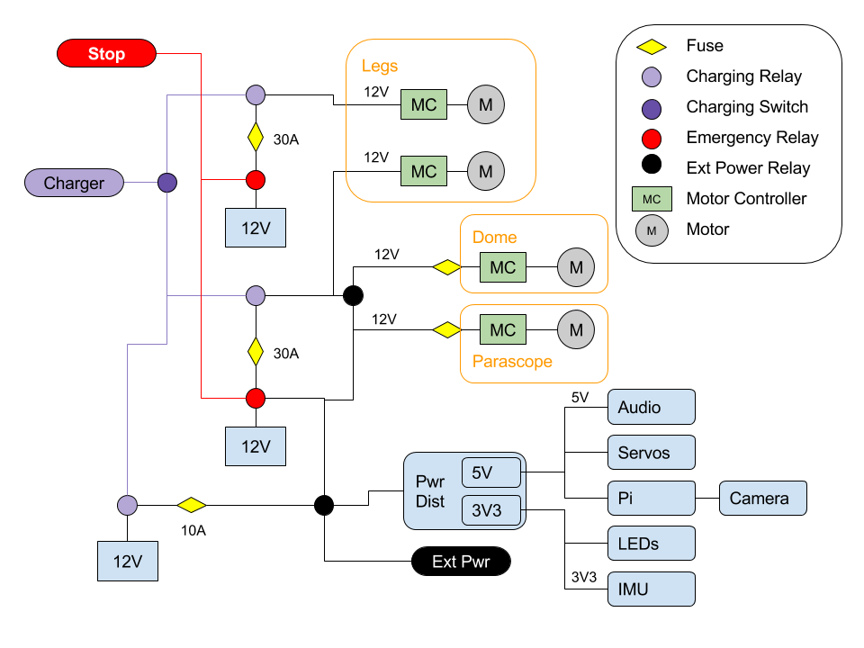
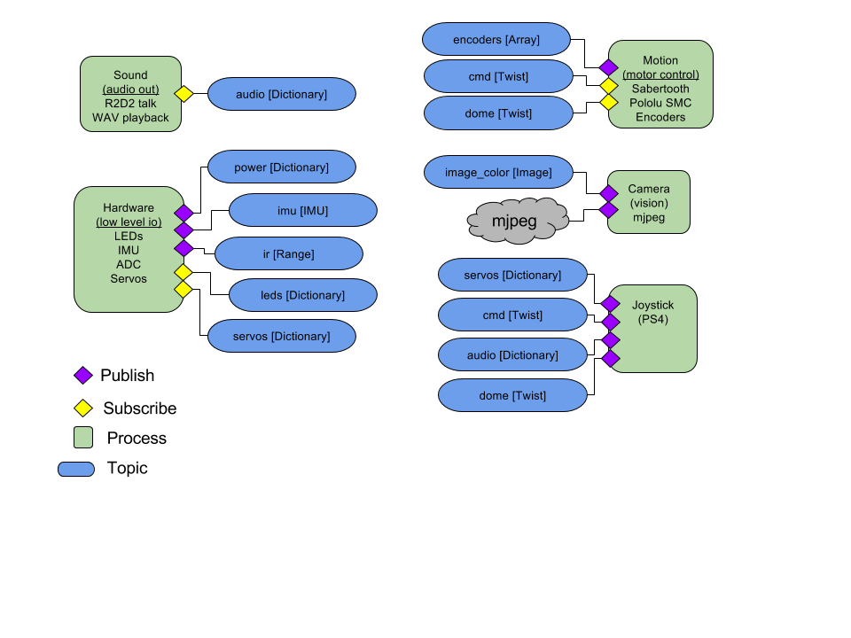

# R2-D2 Senior Design Project

This repo documents the progress of the R2-D2 design for the 2017-2018 class year.

## Architecture

### Power

The power system is modelled around a common 12V system. Relays are used to route power for emergency stop, charging, or other reasons.

### Data

The system data shows the wiring between the pi and all of the sensors and effectors. Most of the communications operates at 3.3v, however, there is a USB serial that operates at 5v (5V TTL). The pi uses all of the buses available to it: I2C at 100 Hz, SPI, and USB. The PWM to drive the servos is off loaded to a hardware servo controller board. Similarly, the PWM which drives the motors is offloaded to 2 different motor controllers (Sabertoth and SMC). 

### Software

The software architecture follows a simple ROS like publisher/subscriber architecture. The popular [Zero MQ](http://zeromq.org/) (zmq) is used for the pub/sub. Publishers publish data to topics which allow subscribers to get the correct data they want, because they subscribe to a topic. For example, if I (a subscriber) want to get commands for the robot leg, I could subscribe to *cmd*. The data types passed along the topics are listed in the brackets. Thus for commands, it uses a message format called *Twist*. [PyGecko](https://pypi.python.org/pypi/pygecko) library is used to neatly wrap zmq and serialize/deserialize the messages. The messages, like *Twist* are directly modelled after [ROS message formats](http://wiki.ros.org/common_msgs). Besides this messaging architecture, nothing else from ROS is used.

## Requirements

1. R2 shall operate in one of three modes:
    1. *remote controlled* [threshold] - R2 shall allow semi-autonomous operation (via a bluetooth joystick) where the user can drive R2 anywhere. However, R2 will also use all onboard sensors to help ensure (to the best of its ability) the user doesn't damage R2 or issues an unsafe command.
    1. *static display* [threshold] - R2 shall remain stationary (power cut to leg motors) and shall interact with people passing by. Dome motor and servo motors in dome shall continue to have power and operate
    1. *autonomous* [objective] - R2 shall navigate Fairchild hallways without bumping into any person or object
    1. *standby* [threshold] - This is the default boot up mode and charging mode for R2. In this mode, not motion commands are excepted. Under the following situations, R2 will automatically switch to this mode:
        1. charging: R2 shall switch to standby and remain in standby until charging power is disconnected
        1.  ... maybe a diagram in stead???
				
2. When the emergency stop (EMS) button is pressed, R2 shall stop with no power going to all motors, but all electronics shall continue to operate. The EMS shall be mounted where R2's inhibitor switch is located in Episode IV.

3. R2's sensor suite shall allow:
    1. Measure voltage and current at the leg motor batteries and electronics battery. When batteries are low, notify user and when a prescribed depth of discharge is reached, switch operating mode to standby until batteries are charged.
    1. Sense orientation and switch to standby if R2 has fallen down (exceeds a pitch or roll in excess of a predefined value)
    1. Sense Earth's magnetic field, process the information, and use for navigation as needed
    1. Sense angle of dome in order to point the dome in a defined direction
    1. [objective] Sense loud noises and determine the direction
    1. [objective] Record audio for speech-to-text processing
    1. Capture video for on-board processing as needed and streaming (mjpeg) to any standards compliant browser
    1. [objective] Measure leg wheel rotations and process data to determine distance travelled (odometry)
    1. [objective] R2 shall sense stairs and drop-offs (or absence of floor) 360 degress around it along the floor plane
    1. [objective] R2 shall sense obstacles 360 degrees around it along the floor plane
    1. TBD

4. R2's interior shall be clean and designed to be presentation ready.
    1. All cables will will be routed and neat.
    1. All electronics shall be neatly mounted
    1. All cable shall have connectors for easy disconnecting
    1. Design shall be modular and any interior component shall be removable for maintenance without having to cut, unglue, de-solder, or damage the robot in any way.

5. R2 shall be returned to its proper appearance (as seen in Episode IV) with certain exceptions (e.g., emergency stop button):
    1. Holes in dome need to be filled in
    1. Body needs to be re-assembled and outer structure (re)painted as necessary
    1. Leg motors need to be hidden in the battery box
    1. Front leg needs to be attached
    1. Skirt needs to be attached
    1. Leg covers/decorations need to be attached
    1. Leg and dome motors need to be properly mounted

6. R2 shall be fully documented:
    1. All datasheets
    1. All trades
    1. All mechanical drawings produced
    1. All budges: power and weight
    1. All code (both commented and saved in the git repository)

## Software

The following libraries were developed for this:

- [ttastromech](https://pypi.python.org/pypi/ttastromech)
- [smc](https://pypi.python.org/pypi/smc)
- [pysabertooth](https://pypi.python.org/pypi/pysabertooth)

The following are used:

- [pygecko](https://pypi.python.org/pypi/pygecko)
- [mote](https://github.com/MomsFriendlyRobotCompany/mote)
- [fake_rpi](https://pypi.python.org/pypi/fake-rpi)
- [opencvutils](https://pypi.python.org/pypi/opencvutils)
- [nxp_imu](https://pypi.python.org/pypi/nxp-imu)
- [mcp3208](https://pypi.python.org/pypi/mcp3208)
