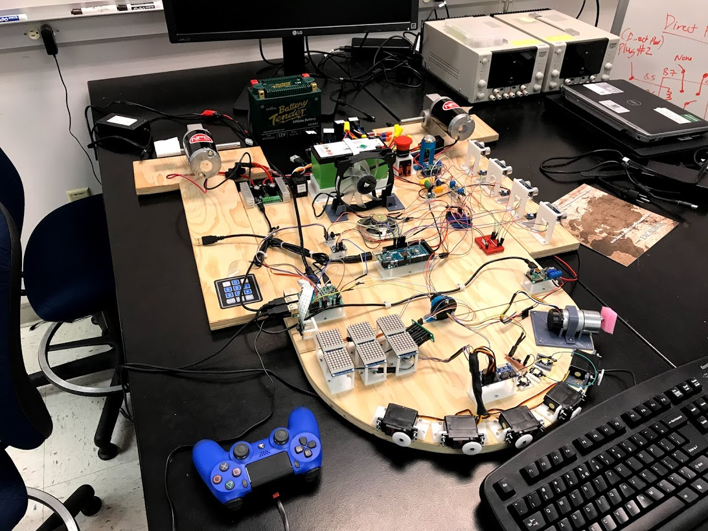

# R2-D2 Senior Design Project

ALL UPDATED FILES CAN BE FOUND IN THE FOLDER LABELED "FINAL"

This repo documents the progress of the R2-D2 design for the 2017-2018 class year. R2-D2's purpose, once
it is delivered, is to:

- Serve as an example of multi-disciplinary engineering
- Support internal events like: Major's Night, DF events, and DFEC events
- Support external events like: STEM outreach and recruiting events.

# Architecture

## Power

The power system is modeled around a common 12V system. Relays are used to route power for emergency stop, charging, or other reasons. The 12V is split into 5V and 3.3V using voltage regulators to power the raspberry pi, Arduino, pololu motor driver, LED matrix, servos, fan, and the sabertooth motor driver.

The type of battery that we used for R2D2 is the Motorcycle Battery called Battery Tender Lithium Battery from Deltran. This battery is made from Lithium Iron Phosphate and supplies 12V with 26-35 Amps of power. This allows us to power all the components in R2D2 as well as providing power to the motors, which take up majority of the current.

## Data

The system data shows the wiring between the pi and all of the sensors and effectors. Most of the communications operates at 3.3v, however, there is a USB serial that operates at 5v (5V TTL). The pi uses all of the buses available to it: I2C at 100 Hz, SPI, and USB. The PWM to drive the servos is off loaded to a hardware servo controller board. Similarly, the PWM which drives the motors is offloaded to 2 different motor controllers (Sabertooth and SMC).

## Software Operating Modes

The system shall follow the transition diagram shown above with the following definitions:

- **Off:** The off mode of R2D2 is when R2D2 is powered off or without any power source. This means that none of the operations are possible, and R2D2 non-functional.
- **Standby:** The standby mode of R2D2 is when R2D2 is remaining idle. None of the motors or the sensors are working in this mode. The Standby mode operates to allow users the ability to fix problems. It is the default mode upon turning R2D2 on.
- **Remote Controlled:** The remote mode of R2D2 can be controlled through the PS4 controller. The instructions on how to connect the PS4 controller to R2D2 can be found in the operational manual. All functionalities of R2D2 is present in this mode.
- **Display:** The display mode of R2D2 is used to showcase R2D2. This means that R2D2 is not capable of moving, because it is in display mode. The display mode will respond to people that are close to R2D2.

# Software

R2 is written primarily in python. The following libraries were developed for R2-D2:

- [Text-to-Astromech: ttastromech](https://pypi.python.org/pypi/ttastromech)
- [Simple Motor Controler: smc](https://pypi.python.org/pypi/smc)
- [Sabertooth Motor Controller: pysabertooth](https://pypi.python.org/pypi/pysabertooth)

The following are used:

- [mote](https://github.com/MomsFriendlyRobotCompany/mote)
- [fake_rpi](https://pypi.python.org/pypi/fake-rpi)
- [opencvutils](https://pypi.python.org/pypi/opencvutils)
- [nxp_imu](https://pypi.python.org/pypi/nxp-imu)

The following was created for the purpose of R2D2's code simplicity, which combines the above codes into one python library file:

- [library](https://github.com/DFEC-R2D2/r2d2/blob/master/final_design/code/library.py)

The sound files that R2D2 plays can be loaded in with the clips sound files and through the sounds.py with the extension of `clips.json`, which initializes the sound files to the sounds.py file.

- [sounds](https://github.com/DFEC-R2D2/r2d2/blob/master/final_design/code/sounds.py)

The R2D2 code can be found in the directory called Final with the python file named run.py.

- [run](https://github.com/DFEC-R2D2/r2d2/blob/master/final_design/code/run.py)

Currently, the Raspberry Pi 3 image that we created allows R2D2 to automatically run this code when booted on. All the USB devices that are connected to the R2D2 are based on our actual model, and would need to be changed to match the serial information of the new device if you are considering making another R2D2. If needed, the image file can be acquired through the DFEC Department Instructor Major Kevin Walchko.

The functions that are created for R2D2 can be followed below:

- **random_char(length):** This function creates a random character string with specified length as a input to use with TTastromech library. It receives as a input a length in integer, and outputs a string of that specified length.
- **standby(`standbyflag`):** This function is the standby mode function, it receives the `standbyflag`, which is set by the keypad on R2D2. This flag is set when 1 is pressed, and continues to be set until R2D2 is put into another mode. At this stage, R2D2 is sitting idle until another mode is pressed. This means that R2D2 will have no motor controls, and will not be reading from any of its sensor. No command can be given, unless its given predefined emotions from buttons 4, 5, and 6.
- **static(`staticflag`):** This function is the static mode function, it receives the `staticflag`, which is set by the keypad on R2D2. This flag is set when 2 is pressed, and continues to be set until R2D2 is put into another mode. The static display mode ensures that R2D2 does not have any motor controls, but reads from its sensors. All functions are available on static display mode except for the motors.
- **remote(`remoteflag`):** This function is the remote mode function, it receives the `remoteflag`, which is set by the keypad on R2D2. This flag is set when 3 is pressed, and continues to be set until R2D2 is put into another mode. The remote mode ensure that R2D2 has full capabilities, such that the motor control works, and all its functionalities are present. R2D2 will be controlled through the PS4 controller. The instructions for connecting the PS4 controller to R2D2 can be found in the operations manual.
- **reboot(`rebootflag`):** This function is the reboot function. This can be called at any mode and will reboot R2D2. This function receives the `rebootflag` from the button *. Once this `rebootflag` is set, the function calls on a reboot command to the terminal, hence terminating all running processes and restarting the raspberry pi 3.
- **shutdown(`shutdownflag`):** This function is the shutdown function. This can be called at any mode and will reboot R2D2. This function receives the `shutdownflag` from the button #. Once this `shutdownflag` is set, the function calls on a shutdown command to the terminal, hence terminating all running processes and shutting down the raspberry pi 3.
- **happy():** This function does not have any inputs or outputs, as the commands are given from the function. The happy function turns on the green LED on the 8x8 matrix LED pads, and also spins the dome. The top hatch of R2D2 will open in a wave and close in a wave. This can be either called from the keypad button 4, or from the arrow hat on the controller.
- **confused():** This function does not have any inputs or outputs, as the commands are given from the function. The happy function turns on the orange LED on the 8x8 matrix LED pads. This can be either called from the keypad button 5, or from the arrow hat on the controller.
- **angry():** This function does not have any inputs or outputs, as the commands are given from the function. The happy function turns on the red LED on the 8x8 matrix LED pads, and plays the imperial theme sound. Once the theme sound is complete, it opens the top hatch of R2D2 and closes it afterwards. This can be either called from the keypad button 6, or from the arrow hat on the controller.
- **battery(`battflag`):** This function is automatically ran when R2D2 is powered on. It receives the `battflag`, which is set when R2D2 is powered on. This enables the user to gauge the battery level of the battery. This is only shown when the battery is plugged in. If it is powered through the wall cable, then it will display all red.
- **mode(`standbyflag`, `staticflag`, `remoteflag`):** This function is automatically ran when R2D2 is powered on. It receives the status of the standby, static, and remote flags and based on those flags, will turn on colors corresponding to the mode of R2D2.

# Project in Pictures

## Functional Development: Breadboard

This was R2's electronics on a box. It allowed full software design/testing with similar hardware without worrying about actually having R2's body built.

# Fit Development: Brassboard

This was the next level and allowed development/testing against the exact hardware and interfaces in R2.

# Building

Many of the hindges, mounting brackets, etc were designed and 3d printed. The largest design was the 2 rear feet. They were completely designed and 3d printed. They were painted using Rust-Oleum paint and primer. 

# Integration

## Electronics

All of the electronics in the body were mounted on a clear piece of plexiglass.

## Dome

Mounts for all of the parts were 3d printed and epoxied to the dome. Then the electronics were bolted to the mounts.

## Everything Else

